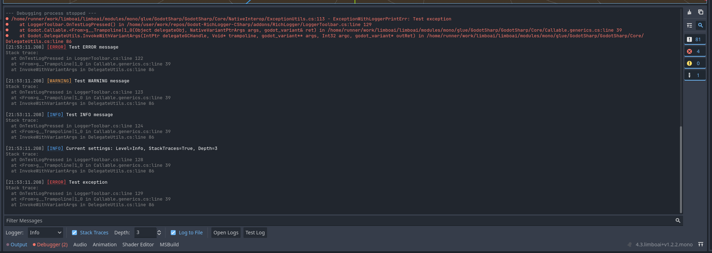

# Godot RichLogger C#
A feature-rich logging utility addon for Godot 4.x C# projects that enhances the default Godot output panel with additional functionality.



## Features
- **Enhanced Output Formatting** - Format your logs with rich text, colors, and styling
- **5 Log Levels** - Error, Warning, Info, Debug, Verbose with visual differentiation
- **Stack Traces** - Toggle stack traces on/off with configurable depth
- **Caller Information** - Hover over log level to see class, method, file, and line number
- **Integrated Toolbar** - Convenient controls added to the output panel
- **Runtime Settings** - Change log settings during gameplay, updates automatically
- **File Logging** - Write logs to files, quick access button to open logs directory, non-blocking file I/O
- **Easy Integration** - Simple API for logging from anywhere in your Godot C# code

## Installation
1. Download or clone this repository
2. Copy the `addons/RichLogger` folder to your Godot project's `addons` folder
3. Compile project
4. Enable the plugin in Godot via Project > Project Settings > Plugins

## Usage
### Basic Logging
``` csharp
Logger.Error("This is an error message");
Logger.Warning("This is a warning message");
Logger.Info("This is an information message");
Logger.Debug("This is a debug message");
Logger.Verbose("This is a verbose message");
```

### Formatted Logging
``` csharp
// Use BBCode for rich text formatting
Logger.Info("[b]Bold text[/b] and [i]italic text[/i]");
Logger.Debug("Player position: [color=yellow]" + player.Position + "[/color]");
```

### Stack Traces
``` csharp
// Enable stack traces from the toolbar or programmatically
Logger.IncludeStackTraces = true;
Logger.StackTraceDepth = 5;

Logger.Error("Something went wrong");
// Output includes stack trace with 5 frames
```

### Logging Objects
``` csharp
Logger.LogObject(LogLevel.Info, "Player", playerNode);
// Output: Player: <Node:12345>
```

### File Logging
Logs are automatically written to `user://logs/` when enabled:
- Files are named: `logger_YYYY-MM-DD_HH-mm-ss_editor.log` or `logger_YYYY-MM-DD_HH-mm-ss_game.log`
- Editor and game maintain separate log files
- Automatically keeps last 10 log files (older files are deleted)
- BBCode formatting is stripped for clean file output
- Non-blocking I/O using Godot's WorkerThreadPool

### Runtime Settings Changes
All settings can be changed during gameplay:
- Changes in editor toolbar automatically sync to running game
- Settings persist across sessions via `user://logger_settings.cfg`
- Updates check every 1 second with non-blocking file I/O

## Contributing
Contributions are welcome! Please feel free to submit a Pull Request.

## License
This plugin is released under the MIT License. See the LICENSE file for details.  

_Made with ❤️ for the Godot community_
